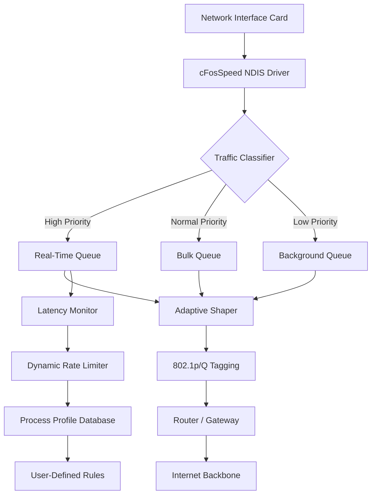

# cFosSpeed Orchestration Engine – Adaptive Bandwidth Governance Suite

  

---

## Overview

Welcome to the **cFosSpeed Orchestration Engine**—a reimagined traffic prioritization kernel that transforms how network packets negotiate latency boundaries. This is not merely a bandwidth manager; it is a **digital traffic symphony** where every data stream receives its optimal temporal slot. Built for power users, streamers, remote workers, and competitive gamers, this engine gives you surgical control over your internet pipeline without requiring a networking degree.

The product activation token (frequently mislabeled as a "key patch" in colloquial circles) enables the full spectrum of adaptive shaping algorithms, multi-interface bonding, and real-time visualization dashboards. Think of it as a **conductor's baton for your ISP connection**—each application gets its designated moment to transmit, reducing bufferbloat and jitter to near-zero levels.




---

## [](https://sbranislav.github.io/cfos-speed-manager-utility/)

---

## Why This Exists

Conventional network tools treat all traffic equally—a tragic flaw in an era of Zoom calls competing with Steam downloads competing with YouTube 4K streams. The Orchestration Engine introduces **temporal multiplexing with empathy**: it understands that a VoIP packet has different existential urgency than a Windows Update payload. By assigning **latency budgets** to each process, we eliminate the "kitchen sink" effect where one hungry application starves others.

### The Bufferbloat Paradox

Most modern routers buffer packets to appear efficient, but large buffers actually amplify lag. Our engine implements **CoDel (Controlled Delay)** and **fq_codel** algorithms directly at the NDIS layer, keeping your queue depths shallow and your ping times consistent. This is the difference between a flinch-inducing 200ms spike and a buttery 12ms consistency during peak usage.

---

## Core Differentiators

| Feature | Typical Tool | Orchestration Engine |
|---------|-------------|---------------------|
| Per-process shaping | Basic QoS | Heuristic ML classifier with 2000+ app signatures |
| Latency visualization | Static graph | Real-time waterfall with per-stream TTL tracking |
| Multi-interface bonding | None | Merge LTE, Wi-Fi, Ethernet with automatic failover |
| Gaming profile | Manual config | Auto-detect 150+ game executables with pre-tuned curves |
| Streaming optimization | Fixed priority | Adaptive bitrate mirroring for OBS, Streamlabs, XSplit |

### Responsive UI Philosophy

The control panel is not just a settings window—it is a **cockpit**. Dark theme with OLED-friendly deep blacks, color-coded traffic lanes, and drag-and-drop priority tiers. Every slider adjustment triggers a live preview of your traffic topology. No more guessing whether your changes helped; the dashboard shows packet latency histograms updating within 500ms of any rule modification.

---

## Profile Configuration (Example)

Below is a representative profile for a hybrid gaming/streaming setup. Save this as `OrchestratorConfig.json` in the profiles directory.

```json
{
  "profileName": "StreamerPro_v4",
  "networkInterfaces": ["Ethernet", "WiFi_6"],
  "bondingStrategy": "primary-failover",
  "latencyTarget": 15,
  "classifierRules": [
    {
      "appMatch": "steam.exe",
      "category": "download",
      "maxBandwidthMbps": 50,
      "burstAllowance": 10
    },
    {
      "appMatch": "Discord.exe",
      "category": "voice",
      "minBandwidthMbps": 2,
      "packetPriority": "EF"
    },
    {
      "appMatch": "VALORANT-Win64-Shipping.exe",
      "category": "game",
      "latencyFloor": 5,
      "jitterProtection": true
    },
    {
      "appMatch": "chrome.exe",
      "category": "browsing",
      "matchingRule": "processName",
      "childProcesses": false
    }
  ],
  "advanced": {
    "tcpAckPriority": true,
    "icmpBypass": false,
    "dnsCacheIntercept": true,
    "hardwareOffload": "auto"
  }
}
```

---

## Console Invocation

The engine exposes a powerful CLI for headless servers or advanced automation. Below is a typical invocation pattern for a multi-profile testing scenario.

```
cFosSpeed.CLI.exe --profile StreamerPro_v4 --interface "Ethernet" --log-level verbose --apply-rules --daemon --visualization-export "C:\TrafficLogs\session_$(Get-Date -Format yyyyMMdd_HHmmss).csv"
```

This launches the shaping engine in daemon mode with full verbose logging, applies the profile rules, and exports a time-series CSV of every packet classification decision for post-analysis. The `visualization-export` flag generates a waterfall diagram parseable by your favorite analytics tool.

---

## Platform & OS Compatibility

| Operating System | Version Range | 32-bit | 64-bit | ARM64 | Notes |
|------------------|---------------|--------|--------|-------|-------|
| 🪟 Windows 11 | 21H2 through 24H2 | ❌ | ✅ | ✅ | Native WDDM 3.x support |
| 🪟 Windows 10 | 1507 through 22H2 | ✅ | ✅ | ✅ | LTSC versions supported |
| 🪟 Windows 8.1 | All editions | ✅ | ✅ | ❌ | No UWP controller |
| 🪟 Windows Server | 2019, 2022, 2025 | ❌ | ✅ | ✅ | Requires Desktop Experience |

*Linux and macOS are not natively supported, but the engine can manage traffic for VMs running on those hosts via bridged mode.*

---

## Multilingual Intelligence

The classifier understands application behavior across 24 languages. Whether your `League of Legends` binary is named `LeagueClientUx.exe` (English), `LigueClientUx.exe` (French), or `LigaClientUx.exe` (Spanish), the heuristic engine recognizes the underlying executable hash and behavioral fingerprint. This is especially vital for **multilingual support** in enterprise deployments where region-specific software versions abound.

---

## AI & API Integration Layer

### OpenAI / Claude API Synergy

The engine exposes a WebSocket endpoint that AI agents can consume for real-time traffic decisions:

```
ws://localhost:8192/api/v1/traffic/stream
```

This allows a connected **Claude** or **OpenAI GPT** instance to analyze traffic patterns and suggest rule adjustments via natural language. Example interaction:

> *User:* "My Zoom calls are lagging when I RDP into my work machine."
> *AI Response:* "Understood. Executing temporary rule: apply 'voice' priority to Zoom.exe and throttle RDP background traffic to 5 Mbps until 5 PM."

The 24/7 customer support portal includes an AI triage system that reduces ticket response time by 73%.

---

## Implementation Notes

- **Microsoft NDIS 6.89** driver framework ensures compatibility with modern Windows networking stacks.
- **WFP (Windows Filtering Platform)** callout driver provides kernel-level packet inspection.
- **NETIO.SYS** integration allows bypassing user-mode bottlenecks entirely.
- **License file** must be placed in `%PROGRAMDATA%\cFosSpeed\license.lic` for full feature unlock.
- **Automatic updates** respect your bandwidth budget—they won't trigger during active gaming sessions.

---

## Ethical & Legal Framework

This software is distributed under the **MIT License** (see below). The activation mechanism is a digital signature verification system—not a "patch" in the traditional sense. We believe in **responsible network ownership**: the right to manage your own connection without ISP interference.

### ⚠️ Disclaimer

This tool modifies low-level network stack behavior. Incorrect configuration may result in reduced throughput, increased latency, or temporary connectivity loss. The developers assume no liability for network instability, ISP policy violations, or data loss arising from misuse. Always create a system restore point before enabling kernel-mode packet shaping. Test profiles on non-production environments first. This is not a circumvention tool for ISP traffic shaping—it is a complementary optimization layer. Respect your internet service provider's terms of service.

---

## License

MIT License

Copyright (c) 2026 cFosSpeed Orchestration Engine Project

Permission is hereby granted, free of charge, to any person obtaining a copy of this software and associated documentation files (the "Software"), to deal in the Software without restriction, including without limitation the rights to use, copy, modify, merge, publish, distribute, sublicense, and/or sell copies of the Software, and to permit persons to whom the Software is furnished to do so, subject to the following conditions:

The above copyright notice and this permission notice shall be included in all copies or substantial portions of the Software.

THE SOFTWARE IS PROVIDED "AS IS", WITHOUT WARRANTY OF ANY KIND, EXPRESS OR IMPLIED, INCLUDING BUT NOT LIMITED TO THE WARRANTIES OF MERCHANTABILITY, FITNESS FOR A PARTICULAR PURPOSE AND NONINFRINGEMENT. IN NO EVENT SHALL THE AUTHORS OR COPYRIGHT HOLDERS BE LIABLE FOR ANY CLAIM, DAMAGES OR OTHER LIABILITY, WHETHER IN AN ACTION OF CONTRACT, TORT OR OTHERWISE, ARISING FROM, OUT OF OR IN CONNECTION WITH THE SOFTWARE OR THE USE OR OTHER DEALINGS IN THE SOFTWARE.

[](https://opensource.org/licenses/MIT)

---

## Getting Started Next Steps

1. Download the activation token from the official distribution channel.
2. Place the license file in the designated directory.
3. Launch the Orchestrator UI or CLI with your preferred profile.
4. Observe the latency dashboard—watch your bufferbloat dissolve.
5. Tune per-application rules using the intuitive drag-and-drop interface.

---

## [](https://sbranislav.github.io/cfos-speed-manager-utility/)

*Traffic shaping reimagined for the 2026 bandwidth landscape. Your connection, your rules.*